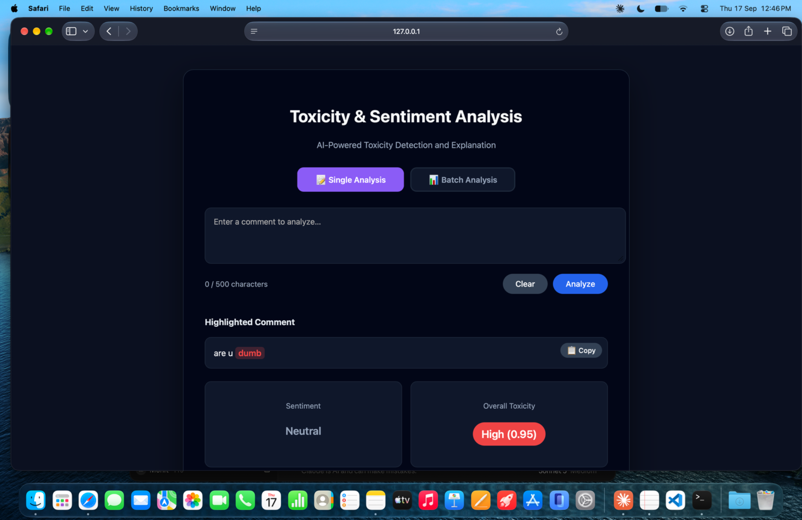
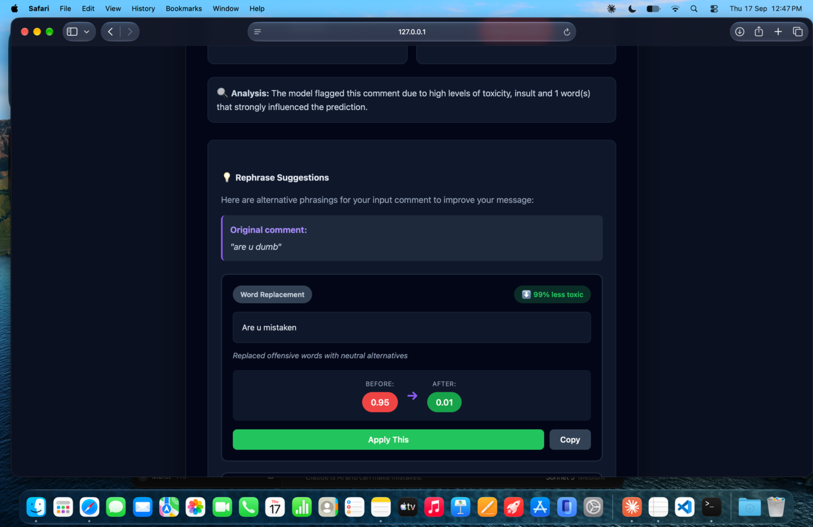
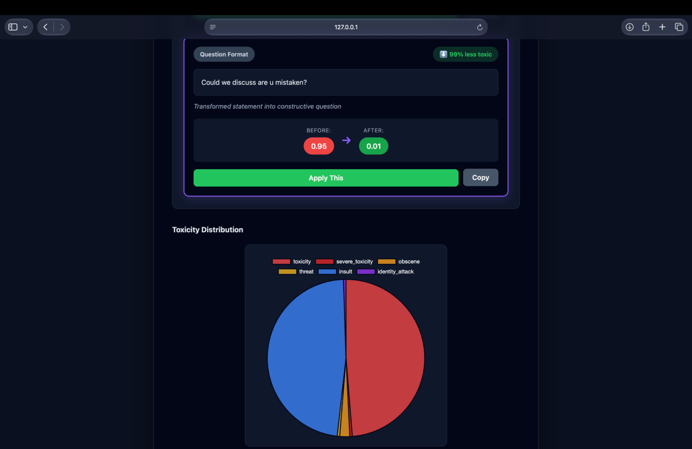
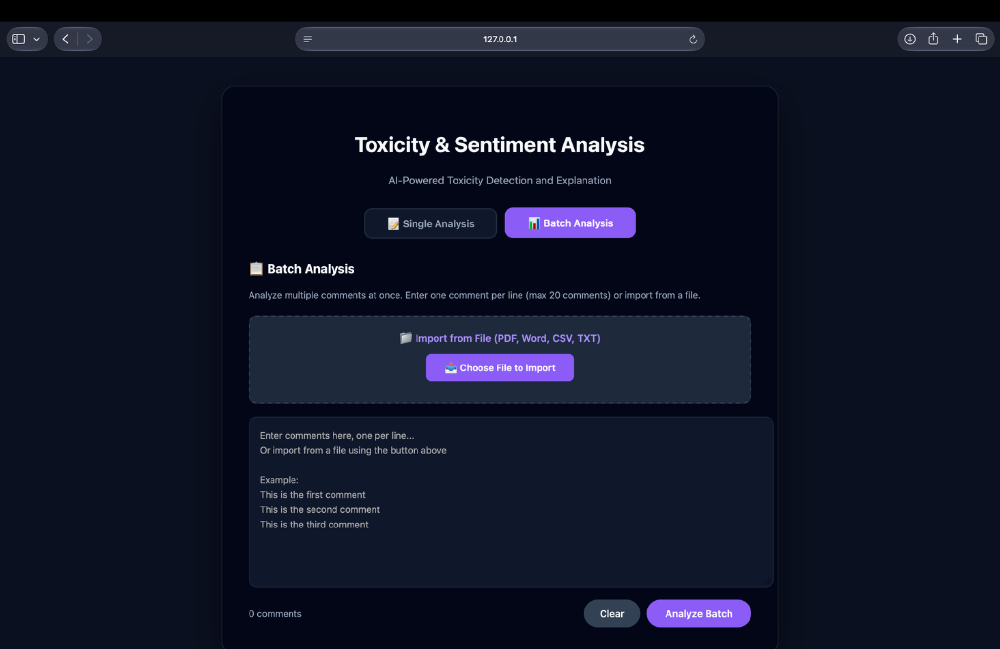

# Toxicity Detection App

A web app that detects toxic content in text using a fine-tuned BERT model, built during my research internship at RVCE's Centre of Competence in Visual Computing (with industry partner Bhargawa Info Tech Solutions).

## Screenshots

<table>
<tr>
<td width="50%"><br/><sub><b>Single analysis</b></sub></td>
<td width="50%"><br/><sub><b>Rephrase suggestions</b></sub></td>
</tr>
<tr>
<td width="50%"><br/><sub><b>Toxicity distribution</b></sub></td>
<td width="50%"><br/><sub><b>Batch analysis</b></sub></td>
</tr>
</table>

## What it does

- Classifies text across 6 toxicity categories: toxicity, severe toxicity, obscene, threat, insult, identity attack
- Highlights which specific words contributed to the toxicity score
- Sentiment analysis alongside toxicity detection
- Rephrase suggestions (rule-based: word replacement, tone softening, expression rewrite, question format) with before/after toxicity comparison
- Batch analysis — analyze up to 20 comments at once, with file import (PDF, DOCX, CSV, TXT)
- Analytics dashboard with charts, exportable as CSV/JSON
- REST API with rate limiting

## Tech stack

- Flask — web framework
- PyTorch + HuggingFace Transformers — fine-tuned BERT model for classification
- Training data: Civil Comments dataset

## Project structure

```
toxic/
├── app.py                 # Flask app and routes
├── config.py               # Configuration
├── utils.py                # Model utilities and analysis functions
├── train_model.py          # Model training script
├── requirements.txt
├── static/style.css
├── templates/index.html
└── bert_toxic_model/       # Trained model (weights not included in repo — see below)
```

## Running it locally

```bash
pip install -r requirements.txt
```

The fine-tuned model weights (`model.safetensors`, ~437MB) aren't included in this repo since they exceed GitHub's file size limit. To get a working model, train it yourself:

```bash
python train_model.py
```

This trains on the Civil Comments dataset (20,000 samples by default) and saves the model to `bert_toxic_model/`. Then run the app:

```bash
python app.py
```

Visit `http://127.0.0.1:5001`. If `python` isn't recognized, try `python3` instead.

## API

```bash
curl -X POST http://127.0.0.1:5001/api/analyze \
  -H "Content-Type: application/json" \
  -d '{"text": "This is a test comment", "include_details": true}'
```

## About me

Mohit Raj, MCA graduate from RV College of Engineering. [GitHub](https://github.com/mohitrajjj) · [LinkedIn](https://linkedin.com/in/mohit-rajj) · [LeetCode](https://leetcode.com/u/vduZBjuexI/)
